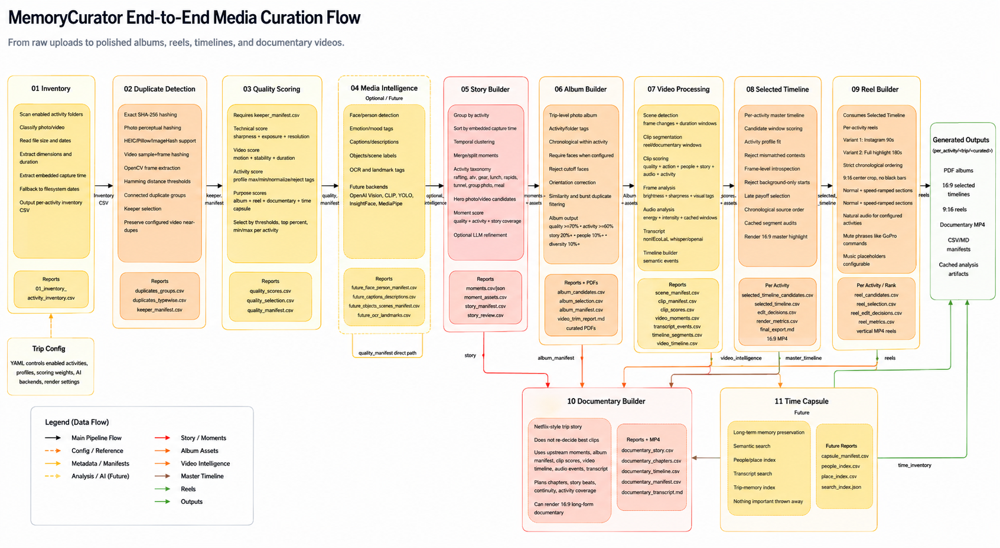

# MemoryCurator

MemoryCurator is a Python media curation engine for trips, reunions, weddings, events, and activity-based memories. It turns raw photos and videos into structured inventories, duplicate-safe manifests, quality-ranked media, story moments, PDF photo albums, selected activity timelines, Instagram reels, and documentary plans.

The project is config-driven: change the trip YAML and activity folders, and the same engine can run on a Bali trip, a birthday, a road trip, or any future media collection.

> Project status: **alpha**. The core pipeline is usable, but scoring, selection, and video-editing taste will keep evolving.

## What It Builds

- Media inventory reports.
- Duplicate and near-duplicate review manifests.
- Quality and purpose scores for photos/videos.
- Moment/story databases by activity.
- PDF photo album selections.
- Activity timeline plans and videos.
- Instagram reel edit decisions and rendered reels.
- Documentary story plans and rendered long-form videos.
- Prompt-only phase specs for people who want to use Codex, ChatGPT, or another AI coding assistant.

## Architecture



Editable diagram: [docs/MemoryCurator_Flow_Diagram.drawio](docs/MemoryCurator_Flow_Diagram.drawio)

For the full phase-by-phase design, scoring logic, model details, and roadmap, see [docs/TECHNICAL_DESIGN.md](docs/TECHNICAL_DESIGN.md).

## Quickstart

```bash
git clone https://github.com/arunwagle/MemoryCuratorRepo.git
cd MemoryCuratorRepo

python3 -m venv .venv
source .venv/bin/activate
pip install -e .

memory-curator --help
memory-curator prompt-guide
```

The repo includes an empty sample trip config:

```text
input_data/trips/sample/config/default.yaml
input_data/trips/sample/data/beach/
input_data/trips/sample/data/adventure/
```

Copy your own photos/videos into the sample activity folders, then run:

```bash
memory-curator --config input_data/trips/sample/config/default.yaml inventory
memory-curator --config input_data/trips/sample/config/default.yaml run-all
memory-curator --config input_data/trips/sample/config/default.yaml run-all --execute
```

Dry runs write reports and edit decisions. `--execute` enables final PDF/video rendering for phases that support final outputs.

## Common Commands

```bash
# Run one phase
memory-curator inventory
memory-curator duplicate-detection
memory-curator quality-scoring
memory-curator story-builder
memory-curator album-builder
memory-curator video-processing
memory-curator selected-timeline
memory-curator reel-builder
memory-curator documentary-builder

# Run everything enabled in config
memory-curator run-all
memory-curator run-all --execute

# Run selected activities only
memory-curator run-all --set beach --execute
memory-curator selected-timeline --set beach --execute
memory-curator reel-builder --set beach --execute

# Prompt-only guide
memory-curator prompt-guide
memory-curator prompt-guide --phase reel-builder
```

If `--config` is omitted, MemoryCurator uses `input_data/trips/sample/config/default.yaml`.

## Input Structure

Use one folder per activity:

```text
input_data/
  trips/
    sample/
      config/
        default.yaml
      data/
        beach/
          photos and videos...
        adventure/
          photos and videos...
      curated/
        generated outputs...
```

Edit the YAML file to enable/disable activities, point to new folders, and tune activity profiles.

## Prompt-Only Usage

MemoryCurator can also be used as a design/prompt library without running the Python engine.

```bash
memory-curator prompt-guide
```

Prompt docs:

- [docs/PROMPT_ONLY_WORKFLOW.md](docs/PROMPT_ONLY_WORKFLOW.md)
- [prompts/duplicate_detection_phase_1.md](prompts/duplicate_detection_phase_1.md)
- [prompts/quality_scoring_phase.md](prompts/quality_scoring_phase.md)
- [prompts/story_builder_phase.md](prompts/story_builder_phase.md)
- [prompts/album_builder_phase.md](prompts/album_builder_phase.md)
- [prompts/video_processing_engine_phase.md](prompts/video_processing_engine_phase.md)
- [prompts/selected_timeline_phase.md](prompts/selected_timeline_phase.md)
- [prompts/reel_builder_phase.md](prompts/reel_builder_phase.md)
- [prompts/documentary_builder_phase.md](prompts/documentary_builder_phase.md)

## Privacy and Data Safety

MemoryCurator is designed so personal media stays local by default. The repository includes a sample trip config, but your real photos, videos, generated outputs, and private trip files should remain on your machine unless you intentionally publish them.

Important defaults:

- Original media under `input_data/trips/<trip>/data` is ignored by Git.
- Generated media under `input_data/trips/<trip>/curated` is ignored by Git.
- Runtime caches are ignored by Git.
- The sample config under `input_data/trips/sample/config` is tracked for quickstart usage.
- Personal trip configs can contain private paths, activity names, or metadata choices, so review them before sharing.
- Documentation images under `docs/` may be tracked intentionally.

## Installation Notes

Use Python 3.10 or newer.

```bash
python3 -m venv .venv
source .venv/bin/activate
pip install -e .
```

If you prefer installing dependencies directly:

```bash
pip install -r requirements.txt
```

For Databricks-proxy environments:

```bash
pip install -r requirements-databricks.txt
pip install -e . --no-deps
```

Optional/advanced dependencies include OpenCV, FFmpeg helpers, Pillow/HEIC support, ReportLab, Torch, and OpenCLIP. AI/ML features are optional and configuration-driven.

## Documentation

- [docs/TECHNICAL_DESIGN.md](docs/TECHNICAL_DESIGN.md): full architecture, phases, scoring logic, reports, and roadmap.
- [docs/PROMPT_ONLY_WORKFLOW.md](docs/PROMPT_ONLY_WORKFLOW.md): how to use the phase prompts directly with an AI coding assistant.
- [docs/OPEN_SOURCE_CHECKLIST.md](docs/OPEN_SOURCE_CHECKLIST.md): maintainer checklist before wider launch.
- [CONTRIBUTING.md](CONTRIBUTING.md): contribution workflow and privacy rules.
- [SECURITY.md](SECURITY.md): responsible disclosure and media privacy notes.

## License

MemoryCurator is licensed under the [Apache License 2.0](LICENSE).
